# primerForge

software to identify primers that can be used to distinguish genomes

## Installation

### pip installation
```shell
pip install primerForge
```

### Manual installation

> [!NOTE]
> This might take up to ten minutes.

```shell
git clone https://github.com/dr-joe-wirth/primerForge.git
conda env create -f primerForge/environment.yml
conda activate primerforge
```

### Docker Installation

A Docker image for the latest release is available at [DockerHub](https://hub.docker.com/r/jwirth/primerforge)

## Usage

```text
usage:
    primerForge [-ioaubfpgtrdnkvh]

required arguments:
    -i, --ingroup        [file] ingroup filename or a file pattern inside double-quotes (eg."*.gbff")

optional arguments: 
    -o, --out            [file] output filename for primer pair data (default: results.tsv)
    -a, --analysis       [file] output basename for primer analysis data (default: distribution)
    -u, --outgroup       [file(s)] outgroup filename or a file pattern inside double-quotes (eg."*.gbff")
    -b, --bad_sizes      [int,int] a range of PCR product lengths that the outgroup cannot produce (default: same as '--pcr_prod')
    -f, --format         [str] file format of the ingroup and outgroup genbank|fasta (default: genbank)
    -p, --primer_len     [int(s)] a single primer length or a range specified as 'min,max' (default: 16,20)
    -g, --gc_range       [float,float] a min and max percent GC specified as a comma separated list (default: 40.0,60.0)
    -t, --tm_range       [float,float] a min and max melting temp (Tm) specified as a comma separated list (default: 55.0,68.0)
    -r, --pcr_prod       [int(s)] a single PCR product length or a range specified as 'min,max' (default: 120,2400)
    -d, --tm_diff        [float] the maximum allowable Tm difference between a pair of primers (default: 5.0)
    -n, --num_threads    [int] the number of threads for parallel processing (default: 1)
    -k, --keep           keep intermediate files (default: False)
    -v, --version        print the version
    -h, --help           print this message
    --debug              run in debug mode (default: False)
```

## Workflow

```mermaid
flowchart TB
    ingroup[/"ingroup genomes"/]
    ingroup --> A

    %% get unique kmers
    subgraph A["for each genome"]
        uniqKmer["get unique kmers"]
    end

    %% get shared kmers
    sharedKmers(["shared kmers"])
    uniqKmer -- intersection --> sharedKmers

    %% get candidate kmers
    subgraph B["for each genome"]
        subgraph B0["for each kmer start position"]
            subgraph B1["pick one kmer"]
                GC{"GC in
                 range?"}
                Tm{"Tm in
                range?"}
                homo{"repeats
                ≤ 3bp?"}
                hair{"no hairpins?"}
                GC-->Tm-->homo-->hair
            end
        end
    end

    %% connections up to candidate kmers
    sharedKmers --> B
    dump1[/"dump to file"/]
    sharedKmers --> dump1
    candidates(["unique, shared kmers; one per start position"])
    hair --> candidates

    %% get primer pairs
    subgraph C["for each genome"]
        bin1["bin overlapping kmers (64bp max)"]
        bin2["get bin pairs"]
        candPair(["candidate primer pairs"])
        sharePair(["shared primer pairs"])

        %% evaluate one kmer pair
        subgraph C0["for each bin pair"]
            size{"is PCR
            size ok?"}
            subgraph C4["for each primer pair"]
                prime{"is 3' end
                G or C?"}
            end
            size --> C4
        end


        %% get shared primer pairs
        subgraph C2["for each candidate primer pair"]
            subgraph C3["for each other genome"]
                pcr{"PCR size ok?"}
            end
        end

        bin1 --> bin2
        bin2 --> C0
        prime --> candPair
        candPair --> C2
        pcr --> sharePair
    end

    allSharePair(["all shared primer pairs"])
    dump2[/"dump to file"/]
    dump3[/"dump to file"/]

    candidates --> dump2
    candidates --> C
    sharePair --> allSharePair
    allSharePair --> dump3

    %% outgroup removal
    outgroup[/"outgroup genomes"/]

    allSharePair --> D0
    outgroup --> D
    subgraph D["for each outgroup genome"]
        subgraph D0["for each primer pair"]
            ogsize{"PCR size outside
            disallowed range?"}
        end
    end
    
    allPairs(["all suitable primer pairs"])
    ogsize --> allPairs

    %% one pair per bin pair
    subgraph E["for each bin pair"]
        keep["keep only one primer
        pair per bin pair"]
    end

    allPairs --> E

    final(["final set of pairs"])
    keep --> final

    write[/"write pairs to file"/]
    plots[/"make plots"/]

    final --> write
    final --> plots
```


