# primerForge

software to identify primers that can be used to distinguish genomes

## Installation
`primerForge` is incompatible with versions python3.8 and below and python3.12 and above.

### `pip` installation
`primerForge` can be installed with the following commands:

```shell
pip install primerforge
conda install ispcr
```

### `conda` installation
A `conda` installation is currently unavailable due to `khmer` being unsupported. We are actively working to resolve this.

### Manual installation

> [!NOTE]
> This might take up to ten minutes.

```shell
git clone https://github.com/dr-joe-wirth/primerForge.git
conda env create -f primerForge/environment.yml
conda activate primerforge
```

### Docker Installation

A Docker image for the latest release is available at [DockerHub](https://hub.docker.com/r/jwirth/primerforge)

### Checking installation

If `primerForge` is installed correctly, then the following command should execute without errors:

```shell
primerForge --check_install
```

If you installed manually, you may need to use the following command instead

```shell
python primerForge.py --check_install
```

### Running unit tests
In order to run unit tests, install `primerForge` using [the instructions above](#installation). You will also need to clone the repository if you haven't already:

```bash
git clone https://github.com/dr-joe-wirth/primerForge.git
```

Once installed and cloned, run the following commands to run the unit tests:

> [!NOTE]
> Running `results_test.py` may take up to 30 minutes to complete

```bash
python3 -m unittest discover -s ./primerForge/bin/unit_tests/ -p "*_test.py"
```


## Usage

```text
usage:
    primerForge [-ioaubfpgtrdnkvh]

required arguments:
    -i, --ingroup        [file] ingroup filename or a file pattern inside double-quotes (eg."*.gbff")

optional arguments: 
    -o, --out            [file] output filename for primer pair data (default: results.tsv)
    -a, --analysis       [file] output basename for primer analysis data (default: distribution)
    -u, --outgroup       [file(s)] outgroup filename or a file pattern inside double-quotes (eg."*.gbff")
    -b, --bad_sizes      [int,int] a range of PCR product lengths that the outgroup cannot produce (default: same as '--pcr_prod')
    -f, --format         [str] file format of the ingroup and outgroup genbank|fasta (default: genbank)
    -p, --primer_len     [int(s)] a single primer length or a range specified as 'min,max' (default: 16,20)
    -g, --gc_range       [float,float] a min and max percent GC specified as a comma separated list (default: 40.0,60.0)
    -t, --tm_range       [float,float] a min and max melting temp (Tm) specified as a comma separated list (default: 55.0,68.0)
    -r, --pcr_prod       [int(s)] a single PCR product length or a range specified as 'min,max' (default: 120,2400)
    -d, --tm_diff        [float] the maximum allowable Tm difference between a pair of primers (default: 5.0)
    -n, --num_threads    [int] the number of threads for parallel processing (default: 1)
    -k, --keep           keep intermediate files (default: False)
    -v, --version        print the version
    -h, --help           print this message
    --check_install      check installation
    --debug              run in debug mode (default: False)
```

## Workflow

```mermaid
flowchart TB
    ingroup[/"ingroup genomes"/]
    ingroup --> A

    %% get unique kmers
    subgraph A["for each genome"]
        uniqKmer["get unique kmers"]
    end

    %% get shared kmers
    sharedKmers(["shared kmers"])
    uniqKmer -- intersection --> sharedKmers

    %% get candidate kmers
    subgraph B["for each genome"]
        subgraph B0["for each kmer start position"]
            subgraph B1["pick one kmer"]
                GC{"GC in
                 range?"}
                Tm{"Tm in
                range?"}
                homo{"repeats
                ≤ 3bp?"}
                hair{"no hairpins?"}
                dime{"no homo-
                dimers?"}
                GC-->Tm-->homo-->hair-->dime
            end
        end
    end

    %% connections up to candidate kmers
    sharedKmers --> B
    dump1[/"dump to file"/]
    sharedKmers --> dump1
    candidates(["unique, shared kmers; one per start position"])
    dime --> candidates

    %% get primer pairs
    subgraph C["for one genome"]
        bin1["bin overlapping kmers (64bp max)"]
        bin2["remove kmers that are
        substrings of other kmers"]
        bin3["get bin pairs"]

        %% evaluate one kmer pair
        subgraph C0["for each bin pair"]
            size{"is PCR
            size ok?"}
            subgraph C1["for each primer pair"]
                prime{"is 3' end
                G or C?"}
                temp{"is Tm
                difference ok?"}
                hetero{"no hetero-
                dimers?"}
            end
            size --> C1
        end
    end

    candPair(["candidate primer pairs"])
    allSharePair(["all shared primer pairs"])

    %% get shared primer pairs
    subgraph D["for each candidate primer pair"]
        subgraph D0["for each other genome"]
            pcr{"is PCR
            size ok?"}
        end
    end

    bin1 --> bin2
    bin2 --> bin3
    bin3 --> C0
    prime --> temp --> hetero --> candPair
    candPair --> D
    pcr --> allSharePair

    %% one pair per bin pair
    subgraph E["for each bin pair"]
        keep["keep only one primer pair"]
    end
    
    selectedSharePair(["selected shared primer pairs"])
    dump2[/"dump to file"/]
    dump3[/"dump to file"/]

    candidates --> dump2
    candidates --> C
    allSharePair --> E
    keep --> selectedSharePair
    selectedSharePair --> dump3

    %% outgroup removal
    outgroup[/"outgroup genomes"/]

    subgraph F["for each outgroup genome"]
        subgraph F0["for each primer pair"]
            ogsize{"PCR size outside
            disallowed range?"}
        end
    end

    selectedSharePair --> F0
    outgroup --> F
    
    noout(["primer pairs absent from outgroup"])
    ogsize --> noout
    noout --> dump4
    dump4[/"dump to file"/]

    ispcr["filter pairs using isPcr"]
    final(["final primer pairs"])
    dump5[/"dump to file"/]
    write[/"write pairs to file"/]


    noout --> ispcr
    ispcr --> final
    final --> dump5
    final --> write
```



## Example using `Mycloplasma mycoides` genomes
This example assumes you have already installed `primerForge` [as described above](#installation).

### Motivation
In this example, we will use `primerForge` to find pairs ofprimers between 18bp and 24bp that can be used to differentiate three strains of _Mycoplasma mycoides_ subspecies mycoides (the "ingroup") from two strains of _Mycoplasma mycoides_ subspecies capri (the "outgroup"). The primer pairs identified by `primerForge` are predicted to produce a single PCR product between 500bp and 2000bp in the ingroup. These same primer pairs are predicted to produce PCR products <300bp, >3000bp, or no PCR products at all.

### preparing the workspace
In order to get started, create a directory called `mycoplasma_test` and move into:

```bash
mkdir ./mycoplasma_test
cd ./mycoplasma_test
```

Next, download the following _Mycoplasma mycoides_ genomes using the following commands:
```bash
wget -q -O- ftp://ftp.ncbi.nlm.nih.gov/genomes/all/GCF/003/034/305/GCF_003034305.1_ASM303430v1/GCF_003034305.1_ASM303430v1_genomic.gbff.gz | gzip -d > ./i1.gbff
wget -q -O- ftp://ftp.ncbi.nlm.nih.gov/genomes/all/GCF/003/034/275/GCF_003034275.1_ASM303427v1/GCF_003034275.1_ASM303427v1_genomic.gbff.gz | gzip -d > ./i2.gbff
wget -q -O- ftp://ftp.ncbi.nlm.nih.gov/genomes/all/GCF/003/034/345/GCF_003034345.1_ASM303434v1/GCF_003034345.1_ASM303434v1_genomic.gbff.gz | gzip -d > ./i3.gbff
wget -q -O- ftp://ftp.ncbi.nlm.nih.gov/genomes/all/GCF/900/489/555/GCF_900489555.1_MMC68/GCF_900489555.1_MMC68_genomic.gbff.gz | gzip -d > ./o1.gbff
wget -q -O- ftp://ftp.ncbi.nlm.nih.gov/genomes/all/GCF/018/389/745/GCF_018389745.1_ASM1838974v1/GCF_018389745.1_ASM1838974v1_genomic.gbff.gz | gzip -d > ./o2.gbff
```

If you cannot download the genbank files using `wget`, you can download them manually from NCBI by replacing `ftp://` with `http://` and copying and pasting each address into your web browser (eg. `http://ftp.ncbi.nlm.nih.gov/genomes/all/GCF/003/034/305/GCF_003034305.1_ASM303430v1/GCF_003034305.1_ASM303430v1_genomic.gbff.gz`) and then using `gzip -d` on the downloaded file to uncompress it. Finally, be sure to rename each file as shown above (eg. `mv GCF_003034305.1_ASM303430v1_genomic.gbff i1.gbff`).

### Running `primerForge`
We will use the following flags to specify specific parameters for this example:

  * The `--ingroup` and `--outgroup` flags are both file patterns for the ingroup and outgroup genomes, respectively. It is important that this pattern is enclosed in double-quotes as shown below.
  * The `--pcr_prod` flag indicates that what sizes we want for ingroup products (500bp to 2,000bp)
  * The `--bad_sizes` flag indicates that what sizes we do not want for outgroup products (300bp to 3,000bp).
  * The `--primer_len` flag indicates what length our primers can be (18bp to 24bp)

You can get a list of all available flags using the command `primerForge --help`.

Run `primerForge` using the following command (requires at least 3 Gb of RAM):

```bash
primerForge --ingroup "./i*gbff" --outgroup "./o*gbff" --pcr_prod 500,2000 --bad_sizes 300,3000 --primer_len 18,24
```

After running the command, you should see something like this printed to the screen:

```text
identifying kmers suitable for use as primers in all 3 ingroup genome sequences
    getting shared ingroup kmers that appear once in each genome ... done 00:01:19.32
    dumping shared kmers to '_pickles/sharedKmers.p' ... done 00:00:07.34
    evaluating kmers ... done 00:03:20.11
    identified 30413 candidate kmers
done 00:04:49.18
    dumping candidate kmers to '_pickles/candidates.p' ... done 00:00:01.03
identifying pairs of primers found in all ingroup sequences ... done 00:00:11.60
    identified 16050 primer pairs shared in all ingroup sequences
    dumping unfiltered pairs to '_pickles/pairs.p' ... done 00:00:00.54
removing primer pairs present in the outgroup sequences
    getting outgroup PCR products ... done 00:00:01.01
    filtering primer pairs ... done 00:00:00.53
    processing outgroup results ... done 00:00:00.52
    removed 5905 pairs present in the outgroup (10145 pairs remaining)
    dumping filtered pairs to '_pickles/pairs_noOutgroup.p' ... done 00:00:00.53
validating primer pairs with isPcr ... done 00:00:01.97
    removed 1665 pairs not validated by isPcr (8480 pairs remaining)
    dumping validated pairs to '_pickles/pairs_noOutgroup_validated.p' ... done 00:00:00.53
writing primer pairs to 'results.tsv' ... done 00:00:00.52

total runtime: 00:05:08.49
```

As we can see, `primerForge` found 30,413 kmers that were suitable for use as a primer in all three ingroup genomes. It then went on to identify 16,050 primer pairs that would produce PCR products between 500bp and 2000bp in the ingroup genomes. Next, it found that of those 16,050 pairs, 5,905 of them formed PCR products between 300bp and 3000bp in one or more of the outgroup genomes. Finally, it used `isPcr` to validate the remaining 10,145 primer pairs resulting in 8,480 primer pairs being written to file.

`primerForge` generated `results.tsv`, the file that contains the sequences and details for each primer pair, and `primerForge.log`. Here are a few lines from `results.tsv`:

|fwd_seq|fwd_Tm|fwd_GC|rev_seq|rev_Tm|rev_GC|i1.gbff_contig|i1.gbff_length|i2.gbff_contig|i2.gbff_length|i3.gbff_contig|i3.gbff_length|o1.gbff_contig|o1.gbff_length|o2.gbff_contig|o2.gbff_length|
|:------|:-----|:-----|:------|:-----|:-----|:------------:|:------------:|:------------:|:------------:|:------------:|:------------:|:------------:|:------------:|:------------:|:------------:|
|TATGCAACTAATCCCGAGTATCAC|56.1|41.7|TGTAAGTGGCGTTGTATCCC|55.5|50|NZ_LAUX01000130.1|521|NZ_LAUV01000074.1|521|NZ_LAUY01000118.1|521|NA|0|NA|0|
|TGTTCCTTCACACTCAATAACAGC|57.3|41.7|AGAAGGAACAGTCGCTGAAG|55.4|50|NZ_LAUX01000081.1|1645|NZ_LAUV01000036.1|1645|NZ_LAUY01000073.1|1645|NZ_LS483503.1|3091|NZ_CP065583.1|3103|
|AAGGAGAGTATCGCTTAGTTGATG|56|41.7|CAACAGCAGATGGTTTAGAAAGTG|56.4|41.7|NZ_LAUX01000079.1|788|NZ_LAUV01000035.1|788|NZ_LAUY01000072.1|788|NA|0|NA|0|
|AAGGAGAGTATCGCTTAGTTGATG|56|41.7|ACTCCAATTGCTCTTCCTGAAG|56.2|45.5|NZ_LAUX01000079.1|1053|NZ_LAUV01000035.1|1053|NZ_LAUY01000072.1|1053|NA|0|NA|0|
|TGAAATCACCAGCTATTGCATCAG|57.5|41.7|ACATTGCAACTCCTGAGATTTG|55.1|40.9|NZ_LAUX01000081.1|1998|NZ_LAUV01000036.1|1998|NZ_LAUY01000073.1|1998|NA|0|NA|0|

The first six columns show the forward and reverse sequences (5' --> 3') as well as their melting temperatures and their G+C %. Next, for each genome it lists the contig and the PCR product size that is predicted be produced by this pair. For example, the first pair of primers are predicted to produce PCR products of 521bp the ingroup genomes, and the binding sites for this primer pair in the files `i1.gbff`, `i2.gbff`, and `i3.gbff` can be found in contigs `NZ_LAUX01000130.1`, `NZ_LAUV01000074.1`, and `NZ_LAUY01000118.1`, respectively. This same pair is not predicted to produce any PCR products in either outgroup genome. Similarly, the next pair is predicted to produce a PCR product size of 1,645bp in all three ingroup genomes and PCR products sizes of >3,000bp in both the outgroup genomes.

If a primer pair is predicted to produce multiple products in an outgroup genome, then the contig column and the size column will list contigs and sizes in a comma-separated list linked by position. For example, if a primer pair was expected to produce a product of 1,990bp in `contig_1` and 2,024bp in `contig_2` in the genome file `example.gbff`, then the columns for this genome would look like this:

|example.gbff_contig|example.gbff_length|
|:-----------------:|:-----------------:|
|1990,2024|contig1,contig2|

> [!NOTE]
> Multiple PCR products will only ever be predicted for outgroup genomes as `primerForge` does not allow such primer pairs in the ingroup genome.

## Common error messages (and possible solutions)
### `detected wildcards that are not enclosed in quotes`
This error occurs if you specify a wildcard representing input files without enclosing them in quotes. For example, this will cause the error:

```bash
primerForge --ingroup ./i*gbff
```

and this will fix it:

```bash
primerForge --ingroup "./i*gbff"
```

The same holds true for the `--outgroup` flag.

This error can also occur if you have inadvertently included a space in any of the arguments passed to other flags.

### `invalid or missing file(s)`
This error occurs if the specified file(s) cannot be found or if the file format does not match the `--format` flag (default = `genbank`). Check that the file path is correct and the files can be read. If they are correct, then double check that you have specified `--format fasta` if you are working with `fasta` files.

### `failed to identify a set of kmers shared between the ingroup genomes`
This error occurs if `primerForge` cannot find kmers that are shared in all the ingroup genomes. This can occur if the input genomes are too distantly related, or if one or more of the genomes is of very poor quality. To diagnose this, try repeating the command but include the `--debug` flag. This will report which ingroup genome is causing the number of shared kmers to drop to zero in the `primerForge.log` file.

### `failed to find primer pairs that are absent in the outgroup`
This error occurs if all the primer pairs `primerForge` identified cannot be used to distinguish the ingroup from the outgroup. This most often occurs because one or more members of the outgroup is too closely-related to the ingroup. To diagnose this, try repreating the command but include the `--debug` flag. This will report which outgroup genome is causing the number of shared kmers to drop to zero in the `primerForge.log` file. Alternatively, you can expand your search by widening the ranges passed to the flags `--pcr_prod` and/or `--bad_sizes`.

## Contributing
Thank you for your interest in contributing! Please see the [contributing guidelines](.github/CONTRIBUTING.md) for more information.
